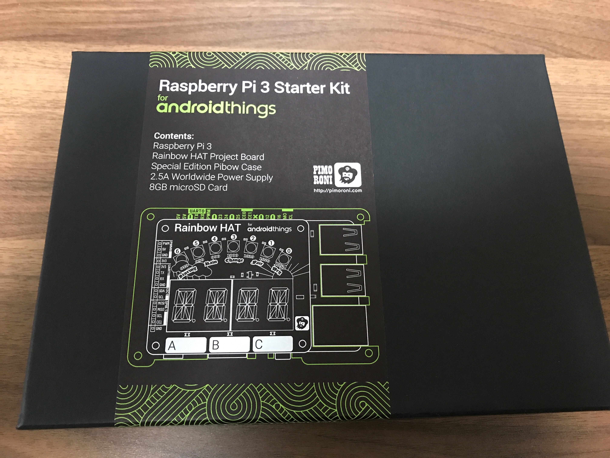

# RainbowHATExample
Android Things Example for Raspberry Pi 3

## 概要
このプロジェクトは、[PIMORONI](http://pimoroni.com)が発売している Android things スターターキット
「Raspberry Pi 3 Starter Kit」の機能のデモです。

## デモの様子

## 実装機能

- 以下の動作チェック機能
  - ボタンA/B/C
  - （ボタン上部の）単色LED
  - ブザー
  - レインボーLED(0～6)
  - 7セグメント

## 未実装機能

- 以下の動作チェック機能は未実装です
  - 温度
  - 湿度
  - 気圧
  
## 将来予定している変更

- プロジェクトのKotlin化
